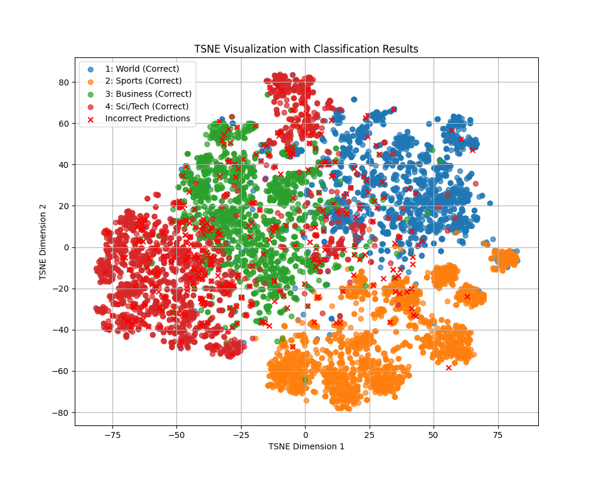

# LLaMA-3.1-8B-AGNews-SFT

## 概要

- Base Model：[LLaMA 3.1 8B](https://ai.meta.com/blog/meta-llama-3-1)
- dataset：[AG News](http://groups.di.unipi.it/~gulli/AG_corpus_of_news_articles.html)
- 训练框架：[LLaMA-Factory](https://github.com/hiyouga/LLaMA-Factory)

## 快速上手

1. 安装 LLaMA-Factory 及相关依赖，参考项目 [repo](https://github.com/hiyouga/LLaMA-Factory)

1. 克隆本项目

    ```bash
    git clone https://github.com/Word2VecT/ LLaMA-3.1-8B-AGNews-SFT
    ```

1. 将本项目 `data` 文件夹替换 LLaMA-Factory 的 `data` 文件夹，或参考 LLaMA-Factory 说明添加数据集信息

1. 安装 Flash Attention 2，参考项目 [repo](https://github.com/Dao-AILab/flash-attention)

1. 开始训练（注意替换输出路径，模型路径可以替换为国内[魔塔社区](https://modelscope.cn/models)，详细见 LLaMA-Factory 说明）

    ```bash
    torchrun --nnodes=1 --nproc-per-node=8 src/train.py \
    --deepspeed examples/deepspeed/ds_z3_config.json \
    --stage sft \
    --do_train \
    --use_fast_tokenizer \
    --flash_attn fa2\
    --model_name_or_path meta-llama/Llama-3.1-8B \
    --dataset ag_news_train \
    --template llama3 \
    --finetuning_type full \
    --output_dir /path/to/your/model \
    --overwrite_cache \
    --overwrite_output_dir \
    --warmup_ratio 0.03 \
    --weight_decay 0. \
    --per_device_train_batch_size 4 \
    --gradient_accumulation_steps 4 \
    --ddp_timeout 9000 \
    --learning_rate 2e-5 \
    --lr_scheduler_type cosine \
    --cutoff_len 4096 \
    --save_steps 2000 \
    --logging_steps 1 \
    --plot_loss \
    --resize_vocab \
    --num_train_epochs 1 \
    --bf16 \
    --report_to wandb \
    --run_name llama3.1-8B-agnews-steps4
    ```

1. 训练结束后运行批量推理

    ```bash
    llamafactory-cli train /path/to/your/LLaMA-3.1-eval.yaml
    ```

1. 运行 eval 脚本（其他可视化脚本同理）

    ```bash
    python /path/to/eval/eval.py
    ```

1. Enjoy!

## 评测

| 分类         | 准确率   | 精确率   | 召回率   | F1 Score  |
|--------------|----------|----------|----------|-----------|
| World        | 95.95%  | 96.87%  | 95.95%  | 96.40%   |
| Sports       | 99.42%  | 99.00%  | 99.42%  | 99.21%   |
| Business     | 91.53%  | 93.95%  | 91.53%  | 92.72%   |
| Sci/Tech     | 94.84%  | 91.99%  | 94.84%  | 93.39%   |
| 总体（宏平均） | 95.43%  | 95.45%  | 95.43%  | 95.43%   |

## 分类效果

